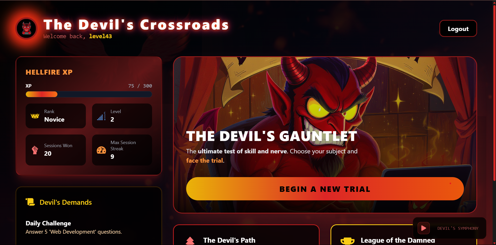

# Byte-Sized Banishment

A devilishly fun, competitive web platform for coding challenges, duels, and skill mastery. Face the Devil's Gauntlet, challenge friends, climb the leaderboard, and level up your coding skills in a gamified, interactive environment.

---



[Live Demo](https://byte-sized-banishment.vercel.app/)

---

## 🚀 Project Overview

Byte-Sized Banishment is a full-stack web application where users:

- Solve coding and MCQ challenges in a timed, gamified environment
- Duel friends and rivals in real-time
- Progress through a skill tree and earn XP, ranks, and blessings/curses
- Compete on a global leaderboard
- Experience immersive devil-themed UI, audio, and effects

## 🛠️ Tech Stack

### Frontend

- **React** (Vite) — Modern, fast SPA framework
- **Tailwind CSS** — Utility-first CSS for rapid UI development
- **Framer Motion** — Animations and transitions
- **React Router** — Client-side routing
- **Axios** — HTTP requests
- **React Flow** — Interactive skill tree visualization

### Backend

- **Node.js** & **Express** — REST API server
- **MongoDB** (Mongoose) — Database for users, sessions, questions, etc.
- **JWT Auth** — Secure authentication
- **Judge0 API** — Code execution for coding questions
- **Nodemailer** — Email for password resets, verification, etc.

### Other

- **Vercel** — Frontend hosting
- **Render** — Backend hosting
- **Cloudinary** (optional) — Media/image hosting

## 📦 Monorepo Structure

```
byte-sized-banishment/
├── client/   # React frontend
├── server/   # Node.js/Express backend
```

## 🌐 Live Link

[https://byte-sized-banishment-f7vm.vercel.app/](https://byte-sized-banishment-f7vm.vercel.app/)

---

## 📝 Getting Started

1. Clone the repo
2. See `client/README.md` and `server/README.md` for setup instructions
3. Configure environment variables as needed
4. Run both client and server

---

## 🙏 Credits

Created by [rahuldev403](https://github.com/rahuldev403) and contributors.

---

## 📄 License

@PWIOI
